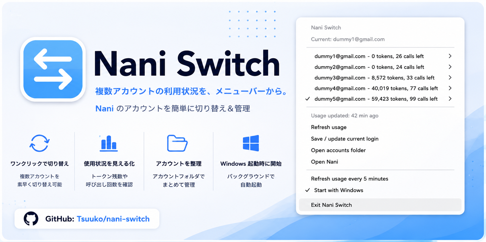

# Nani Switch

[English](README.en.md) | 日本語



## なにこれ？

Naniの複数アカウントをWindowsのタスクトレイから切り替える、軽量な非公式ツールです。

> [!TIP]
> より多くの利用枠が必要な場合、[Naniのチームプラン](https://nani.now/ja/team)は個人でも複数席を契約できます。チーム全体の利用上限は席数に応じて増えるため、利用枠を増やす目的で複数のアカウントを使い分ける必要はありません。

> [!CAUTION]
> 本プロジェクトは研究・学習目的に限定した概念実証（PoC）です。実際のアカウント運用や日常利用には使用しないでください。

> [!WARNING]
> Nani SwitchはNaniおよびKioku LLCの公式製品ではありません。Naniのデータ形式やAPIが変更された場合、動作しなくなる可能性があります。

## 動作環境

- Windows 10またはWindows 11（x64）
- Microsoft Store版Nani

## インストール

研究用途のため、Releaseでの配布は行いません。  
自身でビルド、インストールを行ってください

## 使い方

1. Naniで保存したいアカウントへログインします。
2. トレイメニューから `Save / update current login` を選択します。
3. 別のアカウントへログインし、同じ操作を繰り返します。
4. 保存済みアカウントをトレイメニューから選択すると切り替わります。

切り替え時はNaniを強制終了し、認証情報を更新してから再起動します。確認ダイアログは表示されません。未保存の入力内容は失われます。

## 機能

- 現在のNaniログインを保存・更新
- 保存済みアカウントをJSONの登録順で表示
- 現在のアカウントにチェック表示
- アカウントの切り替えとNaniの再起動
- 各アカウントの残りトークン数、回数、リセットまでの時間を表示
- 起動直後、手動、5分ごとのusage更新
- 5分ごとのusage更新をON/OFF
- Windows起動時の自動起動をON/OFF

## 保存データ

データは `%USERPROFILE%\.nani-switch` に保存されます。

| ファイル          | 内容                               |
| ----------------- | ---------------------------------- |
| `accounts.json`   | 保存済みアカウントと認証情報       |
| `settings.json`   | 定期usage更新などの設定            |
| `nani-switch.log` | 動作ログ（トークンは出力しません） |

> [!IMPORTANT]
> `accounts.json`には、アカウント切り替えに必要な復号済みアクセストークンが保存されます。このファイルを公開、共有、クラウド同期しないでください。

## アンインストール

インストーラー版はWindowsの「インストールされているアプリ」からアンインストールします。ポータブル版は `Start with Windows`をOFFにして終了後、実行ファイルを削除します。

どちらも保存アカウントは自動削除しません。不要な場合は `%USERPROFILE%\.nani-switch` を削除してください。

## 開発

Rust stableとMSVCツールチェーンが必要です。

```powershell
cargo fmt --all -- --check
cargo clippy --all-targets -- -D warnings
cargo test
cargo build --release
```

実行ファイルは `target/release/nani-switch.exe` に生成されます。

## リリース

`Cargo.toml`のバージョンを更新してコミットし、同じバージョンの`v`タグをpushします。

```powershell
git tag v0.1.0
git push origin v0.1.0
```

GitHub ActionsがWindows x64版をビルドし、インストーラー、ポータブルEXE、ZIP、SHA-256チェックサムをDraft Releaseへアップロードします。内容を確認してからGitHub上で公開してください。

既存タグのリリースを手動で作成・再試行する場合は、GitHubの `Actions` → `Release` → `Run workflow` を開き、`Use workflow from` で対象タグを選択します。ブランチを選択した場合は、`Cargo.toml` のバージョンに対応する既存タグを使用します。同じタグで再実行すると、Draft Releaseの生成物を上書きします。

## ライセンス

[MIT License](LICENSE)
